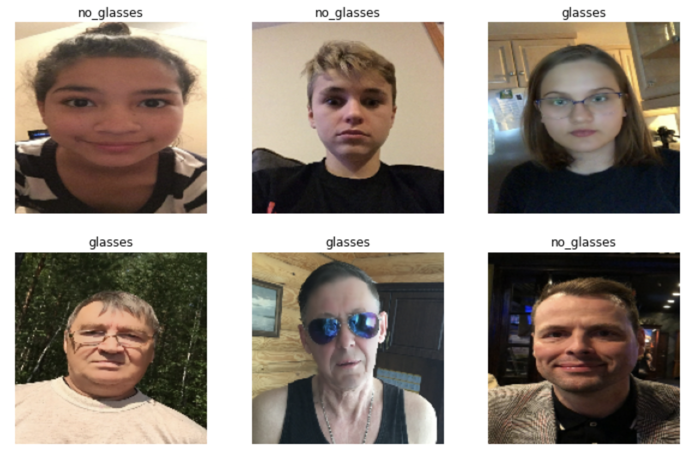

## Model Training
The process of model training was accomplished within Google Colab and can be investigated at `GlassesClassification.ipynb` notebook.

- The entire model is saved at `checkpoints/model/`
- Related process constants are saved at `configurations.py`

## Invoke Inference of the model
```bash
python inference.py --path <PATH_TO_DATASET_FOLDER>  
```   

### Visualisation of sample batch of test images
